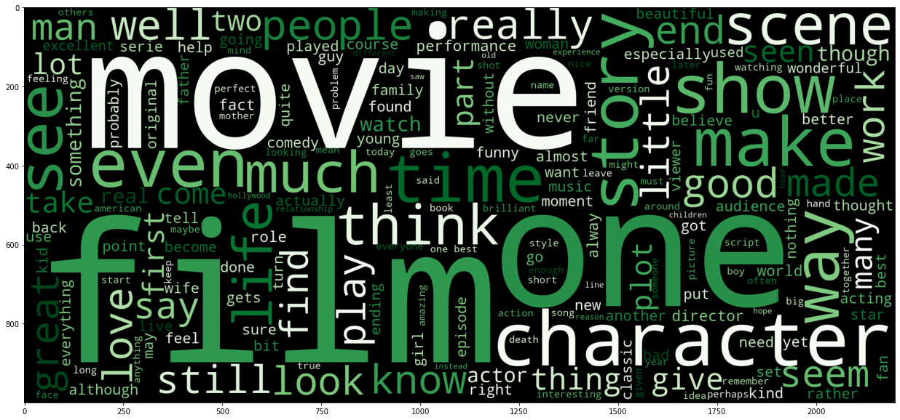
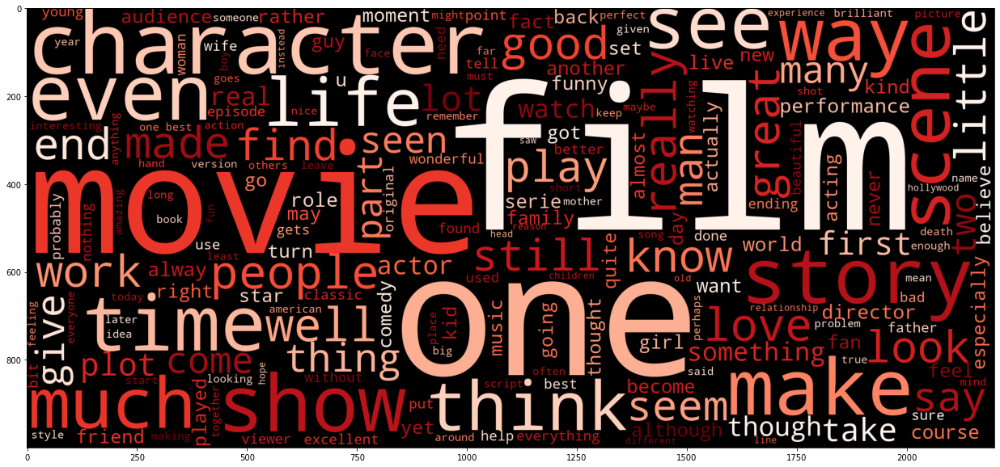
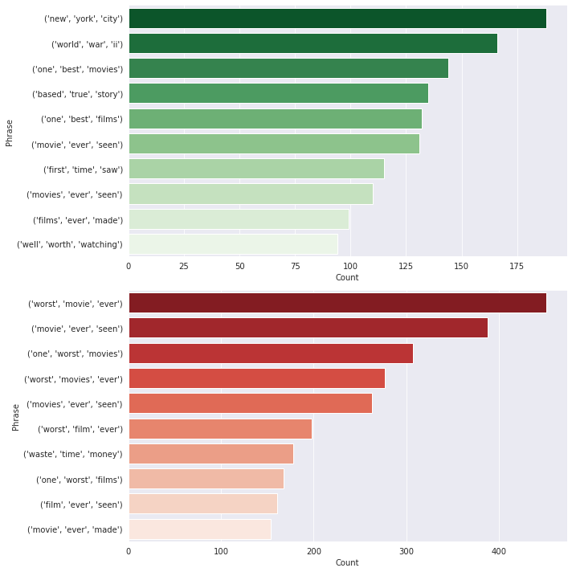
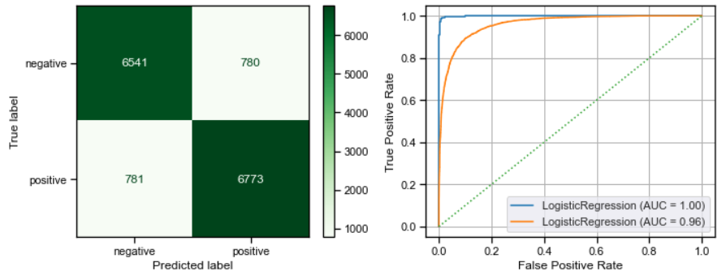
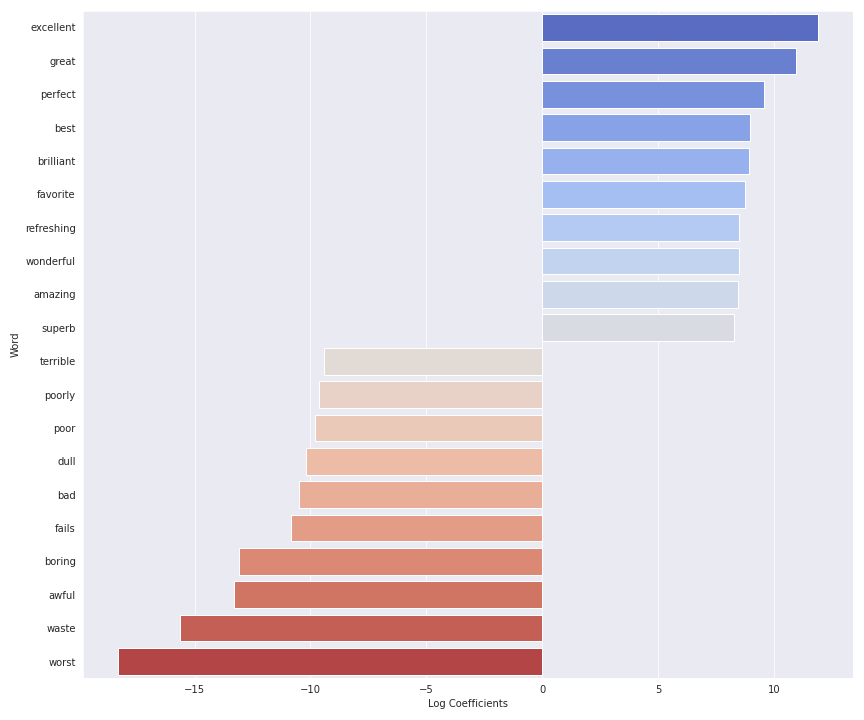

# IMDB Review Sentiment Analysis

**Author**: [Johnny Dryman](mailto:johnnydryman@gmail.com)

## Business Problem

**IMDB** is the world's most popular and authoritative source for movie, TV and celebrity content, designed to help fans explore the world of movies and shows and decide what to watch.

One of the most popular features on the site is its user reviews. Users are able to give each movie a score between 1-10 along with a written review. The average score is a recognized metric in the industry, and IMDB's top movies based on user reviews is a coveted list for impactful films.

One of the issues inherent with user submitted scores is that the 1-10 rating system might mean different things to different reviewers. For example, one reviewer think that a 'good' movie deserves a 6/10, and another might think a 'good' movie deserves an 8/10. Every user has their own evaluation metrics, and this is often determined internally rather than by a specific standard.

## Natural Language Processing

Using Natural Language Processing (NLP), we can create machine learning models that might help us get closer at the core truth of what people are saying with their written reviews.  For modeling, we will use two vectorizers - count vectorization and term frequency - inverse document frequency vectorization.  We will then use both vectorizers to run three machine learning models - logistic regression, random forests, and XGBoost.  

## Data

The data for this project was sourced from Kaggle, a data science community featuring great datasets for exploration and analysis.  The dataset contained 25,000 positive reviews and 25,000 negative reviews, totaling 50,000.  The only other data provided were 'positive' and 'negative' classifications.  According to the source, the reviews were "highly polar," meaning they were strongly positive or strongly negative.

Using this dataset, we can train a model to classify reviews as positive or negative. In theory, distilling the reviews in this fashion would help us to generate a score based on true sentimentality rather than a sliding scale that has different meanings to different users.

## Exploratory Analysis

Word clouds are an intuitive way to visualize word frequency in our reviews.  Let's take a look at how they shape up based on words found in both positive and negative reviews.

### Word Cloud - Positive Reviews



### Word Cloud - Negative Reviews



Other than the color palette, these word clouds look very similar.  It might be worth digging a bit deeper into frequent phrases rather than singular words.

### Ngram comparisons

Using Ngrams will help us dig view common phrases found in our positive and negative reviews.  Here's a graph of trigrams, or three word phrases that appear frequently in our reviews.  These phrases line up with what we would expect in strongly worded movie reviews.



## Best Model

After using logistic regression, random forests, and XGBoost models with both a Count Vectorizer and a TF-IDF Vectorizer, it turns out logistic regression using grid search and the TF-IDF vectorizer return the highest accuracy with 89.51%.  



### Coefficient Analysis

Given the strong performance of the logistic regression model using TF-IDF, it is worth taking a look at the coefficients of the model.  In this case, the coefficients will be the individual tokens in our corpus.  We will be able to tell which words influenced the model in determining whether a review is positive or negative.



Based on this plot of the top 10 influential words in the positive and negative direction, it looks like the model latched onto polar descriptive adjectives that we would normally associate with positive or negative sentiment.  


## Conclusions and Recommendations

The goal of this project was to determine whether or not it would be possible to distinguish between positive and negative reviews using only the content of the review and the 'positive' or 'negative' classifiers.  We accomplished this with reasonable success with grid search logistic regression and the TF-IDF vectorizer scoring 89.51% accuracy.  

We also learned from our EDA and visual exploration of coefficients that the machine learning models are latching onto strong positive and strong negative adjectives to make its decisions.  This does not fall out of line with what we might expect.  

Using this model, we might be able to calculate a new score for movies on IMDB that more closely reflects what is found on the Rotten Tomatoes Critic Score.  A metric like this could help avoid issues where IMDB users felt very similarly about a movie, but gave it different numerical scores based on their own interpretation of the 1-10 scale.  

The benefits of this new type of score might not be immediately tangible, but running this model and scoring all movies in IMDB's database might return an alternate top 250 movies list that would at the very least be interesting to users.

## Next Steps

We aren't entirely sure how each of the 50,000 reviews were deemed 'positive' or 'negative.'  According to the data source on Kaggle, the reviews were "highly polar," but we don't understand how this informed the data collection process.  

It might be worthwhile to pull 50,000 reviews from IMDB in a bucket of scores from 1-3, 4-7, and 8-10.  This would allow us to perform a multiclass sentiment analysis and see if we can determine whether reviews are positive, negative, or neutral.  While computationally expensive and possibly a fool's errand, the same logic could be applied to bucketing every 1-10 score in buckets of 1, 2, 3, etc.

Also, while we explored three models for this project, there are many more machine learning models that we could have attempted, such as support vector machines, k nearest neighbors, and a variety of deep learning / neural network models.  Exploring more models might lead to a higher accuracy and could inform future experimentation.

## For More Information

See the full analysis in the [Jupyter Notebook](Johnny Dryman - Phase 4 Project Notebook.ipynb) or review this [presentation](Johnny Dryman - Phase 4 Project Presentation.pdf).

For additional info, contact Johnny Dryman at [johnnydryman@gmail.com]

## Repository Structure

```
├── data
├── images
├── README.md
├── Johnny Dryman - Phase 4 Project Presentation.pdf
└── Johnny Dryman - Phase 4 Project Notebook.ipynb
```